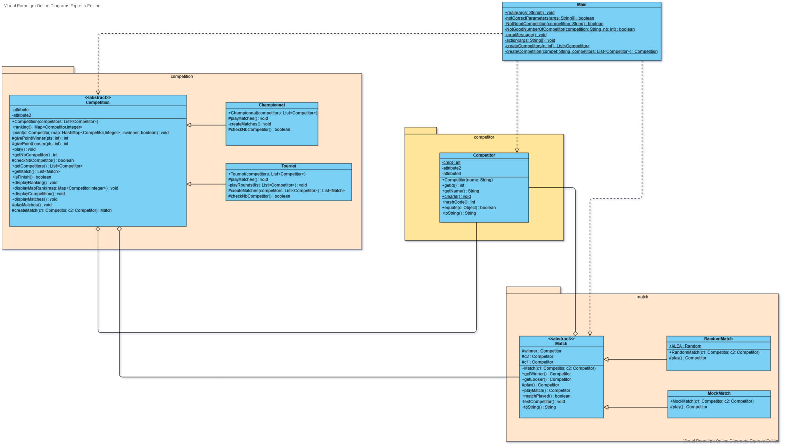

# Proyecto de Diseño Orientada Objeto

Este depósito corresponde al Proyecto de DOO disponible [aquí](media/competitions.pdf "Proyecto").
El Proyecto consiste en crear un diseño de competición.

---
##  Membros del pareja

* Nollet Antonio
* Minaud Mathilde

---
## UML Design

Aquí puedes encontrar nos **UML** diseño del proyecto de competición :

 

 

---
## Contenido de este depósito

* **dist** (distribución de los `.jar` ejecutables)
* **lib** (librario contente lo que efectuar los test y de crear los ejecutables)
* **src** (contente los diferentes codigos `.java`)
* **test** (contente los programas de `test`)
* **media** (contente los `sonidos` y los `imagenes`)
* **makefile** (fichiero simplificando la utilización del proyecto)
* [**readme.md**](readme.md "menú de los readme") (el menú de los readme)
* [**[fr]readme.md**]([fr]readme.md "readme en francés") (el fichiero que esta leeyendo, en francés)
* [**[en]readme.md**]([en]readme.md "readme en inglès") (el fichiero que esta leeyendo, en inglès)
* [**[es]readme.md**]([es]readme.md "readme en español") (el fichiero que esta leeyendo, en español)

---
## Explicación

Si està leyendo este fichero, fue admitido a nos proyectos de DOO.
Utiliza la opción clone de este carpeta DOO y crear una carpeta local, si no ya hacido.

Usted abre una consolà desde la carpeta local, el commando **git pull** està recomendada siempre que usted consulta este proyecto.

Desde la raíz de este trabajo en una consolà, puede executar estes differentes commandos :

* **make** : efectua el `ejecutable` del proyecto
* **make comp** : compila los diferentes `class`
* **make compTest** : compila los `class de test`
* **make doc** : crea la `documentación`
* **make test** : efectua los diferentes `test`
* **make extract** : extracta los class desde los fichieros `.jar`
* **make exe** : crea los `ejecutables`
* **make competition** : efectua el `ejecutable` del projecto
* **make clean** : supprime todos los fichieros `.class`, la carpeta `docs` et los fichieros extractados con `make extract`

---
## 'make competition' : Mensaje de uso

    run with make competition args = "c n"
    where:
    c       = the type of Competition you use (here "t" for Tournament or "l" for League)
    n       = the number of Competitors who participate in the Competition (a power of 2 if you selected the Tournament)
    try:
    make competition args="l 3"
    or
    make competition args="t 4"

---
## Update Master

Hay [aquí](media/competitionsV2.pdf "Update Projet") la nueva version del subjecto.

---
## 'make competition' : update message

    run with make competition args = "c n g m"
    where:
    c            = the type of Competition you use (here "t" for Tournament or "l" for League)
    n            = the number of Competitors who participate in the Competition (a power of 2 if you selected the Tournament)
    g [if c = m] = the number of groups (for Master)  
    m [if c = m] = the number of members per groups (for Master)
    warning for using Master:
    m = g*m and there at least one valid filter for this numbers n g and m
    try:
    make competition args="l 3"
    or
    make competition args="t 4"  
    or
    make competition args="m 8 2 4"

---

Si tiene preguntas sobre este trabajo, no duda a contactar con nosotros vía nos direcciónes electrónicas :

* **mathilde.minaud.etu@univ-lille.fr**
* **antoine.nollet.etu@univ-lille.fr**

Graciás para su lectura !
---
 
 
 

