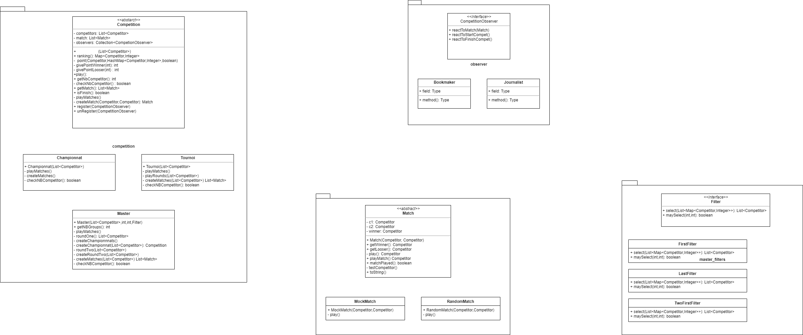

# PROJET de Conception Orienté Objet

Ce dépôt correspond au Projet de COO disponible [ici](media/competitions.pdf "Projet").
Le Projet consistait à créer un concept de Compétitions.

---
##  Membres du binôme

* Minaud Mathilde
* Nollet Antoine

---
## Conception UML

Voici le diagramme **UML** correpondant à notre conception du Projet Competition :

 

 

---
## Contenu de ce dépôt

* [**dist**](dist "dist") (distribution des `.jar` executables)
* [**lib**](lib "lib") (librairie contenant de quoi effectuer les test et de créer les executables)
* [**src**](src "src") (contient les différents codes `.java`)
* [**test**](test "test") (contient les programmes de `test`)
* [**media**](media "media") (contient les `sons` et `images`)
* [**makefile**](makefile "makefile") (fichier facilitant l'utilisation du projet)
* [**readme.md**](readme.md "menu des readme") (le menu des readme)
* [**[fr]readme.md**]([fr]readme.md "readme en français") (le fichier que voici, en français)
* [**[en]readme.md**]([en]readme.md "readme en anglais") (le fichier que voici, en anglais)
* [**[es]readme.md**]([es]readme.md "readme en espagnol") (le fichier que voici, en espagnol)

---
## Explications

Si vous lisez ceci, vous avez été admis à accéder à nos projets COO.
Utilisez l'option clone de ce dossier COO et créer un dossier local, si cela n'est pas déjà fait.

Veuillez ouvrir une console depuis ce dossier local, la commande **git pull** est conseillé à chaque fois que vous retournerez consulter ce projet.

Depuis la racine de ce Projet dans un shell, vous pouvez executer ces différentes commandes :

* **make** : effectue l'`executable` du projet
* **make comp** : compile les différentes `classes`
* **make compTest** : compile les `classes de test`
* **make doc** : crée la `documentation`
* **make test** : effectue les différents `tests`
* **make extract** : extrait les classes depuis les fichiers `.jar`
* **make exe** : crée les `executables`
* **make competition args="c n g m"** : effectue l'`executable` du projet avec les paramètres voulu
* **make example** : effectue l'`executable` du projet
* **make clean** : supprime tous les fichiers `.class`, le dossier `docs` et les fichiers extraits avec `make extract`
---
## Créer une Compétition

Pour créer un nouveau type de Competition, vous devrez créer un objet qui **hérite** de [**Competition**](src/competition_sportive/competition/Competition.java).
Vous devrez donc écrire dans votre objet ces deux méthodes :

* `protected abstract boolean checkNbCompetitor();`
     * Checks if the number of competitors of this competition is correct or not
     * @return if the number of competitors of this competition is correct or not

* `protected abstract void playMatches();`
     * Plays the matches of this Competition

---
## 'make competition' : Message d'utilisation

    run with make competition args = "c n"
    where:
    c       = the type of Competition you use (here "t" for Tournament or "l" for League)
    n       = the number of Competitors who participate in the Competition (a power of 2 if you selected the Tournament)
    try:
    make competition args="l 3"
    or
    make competition args="t 4"

---
## Update Master - Projet v2

Voici [ici](media/competitionsV2.pdf "Update Projet") la nouvelle version du sujet.
Il a fallut réfléchir le concept de sélection entre la première et la deuxième manche.

---
## créer un selecteur

Pour créer un sélecteur, vous devrez créer un objet qui **implemente** l'interface [**Filter**](src/competition_sportive/master_filters/Filter.java).
Vous devrez donc écrire dans votre objet ces deux méthodes :

* `public List<Competitor> select(List<Map<Competitor, Integer>> rankings);`
     * Returns a list of Competitors selected from a list of ranking of Leagues
     * @param rankings list of ranking
     * @return the list of competitors selected

* `public boolean maySelect(int nbgroups, int nbmembers);`
     * Returns if a selection could be done of not for the master
     * @param nbgroups the number of groups in the master we want to make a selection
     * @param nbmembers the number of members per groups in the master we want to make a selection
     * @return if a selection could be done of not

---
## 'make competition' : update message

    run with make competition args = "c n g m"
    where:
    c            = the type of Competition you use (here "t" for Tournament or "l" for League)
    n            = the number of Competitors who participate in the Competition (a power of 2 if you selected the Tournament)
    g [if c = m] = the number of groups (for Master)
    m [if c = m] = the number of members per groups (for Master)
    warning for using Master:
    m = g*m and there at least one valid filter for this numbers n g and m
    try:
    make competition args="l 3"
    or
    make competition args="t 4"
    or
    make competition args="m 8 2 4"

---
## Update Journaliste / Bookmaker - Projet v3

Voici [ici](media/competitionsV3.pdf "Update Journaliste/Bookmaker") la nouvelle version du sujet.
Il a fallut réfléchir le concept d'observateur d'une competition

---
## Créer un observateur

Pour créer un observateur, vous devrez créer un objet qui **implemente** l'interface [**CompetitionObserver**](src/competition_sportive/observer/CompetitionObserver.java).
Vous devrez donc écrire dans votre objet ces trois méthodes :

* `public void reactToMatch(Match m);` (il vous faudra prendre connaissance du type [**Match**](src/competition_sportive/match/Match.java))
     * Reaction of this Observer in front of a match
     * @param m the match to react

* `public void reactToStartCompet();`
     * Reaction of this Observer in front of a starting competition

* `public void reactToFinishCompet(Competition c);`
    * Reaction of this Observer in front of a ending competition
    * @param c the competition

---
## Prise de décisions

Le display se fait dorénavent par les observateurs. Un nouveau Main a été créé, sans qu'il n'y ait de paramètres à prendre en compte.
La commande **make** permet d'executer ce nouveau Main.

---

Si vous avez des questions sur ce projet, n'hésitez pas à nous contacter aux adresses :

* **mathilde.minaud.etu@univ-lille.fr**
* **antoine.nollet.etu@univ-lille.fr**

Merci pour votre lecture !
---
 
 
 

